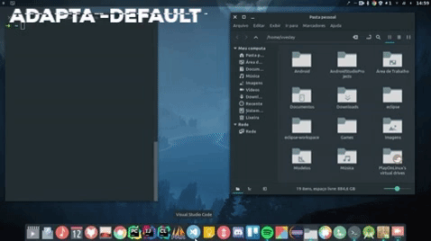
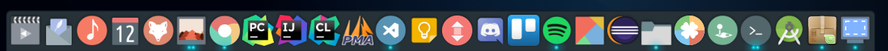
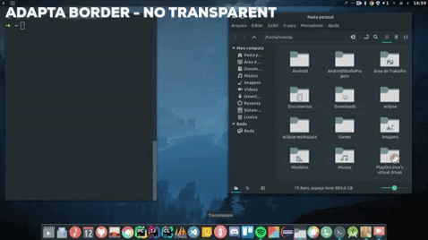
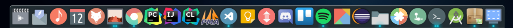
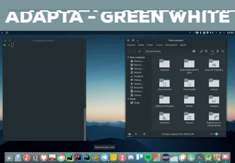
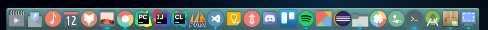

<p align="center">
  <a href="http://serverboladao.eu5.org/">
    
  </a>

  </a>
  
  <h2 align="center">Plank Theme - Adapta</h2>
  
-----
<p align="center">
  
  
  
</p>

```
#The color (RGBA) of the outer stroke.
OuterStrokeColor=20;;25;;40;;200
#The starting color (RGBA) of the fill gradient.
FillStartColor=38;;50;;56;;500
#The ending color (RGBA) of the fill gradient.
FillEndColor=38;;50;;56;;500
#The color (RGBA) of the inner stroke.
InnerStrokeColor=20;;25;;40;;0

```
<p align="center">
  
  
  
</p>


<p align="center">
  
  
  
</p>

```
#The color (RGBA) of the outer stroke.
OuterStrokeColor=20;;25;;40;;0
#The starting color (RGBA) of the fill gradient.
FillStartColor=34;;45;;50;;1000
#The ending color (RGBA) of the fill gradient.
FillEndColor=34;;45;;50;;1000
#The color (RGBA) of the inner stroke.
InnerStrokeColor=1000;;1000;;1000;;0

```
<p align="center">
  
  
  
</p>


<p align="center">
  
  
  
</p>

```
#The color (RGBA) of the outer stroke.
OuterStrokeColor=20;;25;;40;;0
#128,203,196
#The starting color (RGBA) of the fill gradient.
FillStartColor=128;;203;;196;;200
#The ending color (RGBA) of the fill gradient.
FillEndColor=128;;203;;196;;100
#The color (RGBA) of the inner stroke.
InnerStrokeColor=1000;;1000;;1000;;0
```
<p align="center">
  
  
  
</p>


### Install

```
############ How to install themes for Plank Dock?? ############

>>>>>>>>>> If you don't have Plank Dock installed <<<<<<<<<< 
>>> Install it with the command:
```
`sudo apt install plank`

```
>>>>>>>> FOR ROOT DIRECTORY: Open the terminal and type: 
"sudo apt nautilus" or whatever your file manager is.
Copy and paste the extracted files in the next path: 
"/usr/share/plank/themes" ```


>>>>>>>> FOR LOCAL DIRECTORY: Press the ctrl + h keys.
Now the hidden files will be shown. 
Copy and paste the extracted files in the next path:
".local/share/plank/themes"


>>>>>>>> Now, press the Plank Dock Icon or ctrl + right click
on any place in Plack Dock to show the preferences menu. 
Got to "THEME" and choose any Dockjave theme.

| ---------------------------------------------------------------------------------------- |
```
  
  


